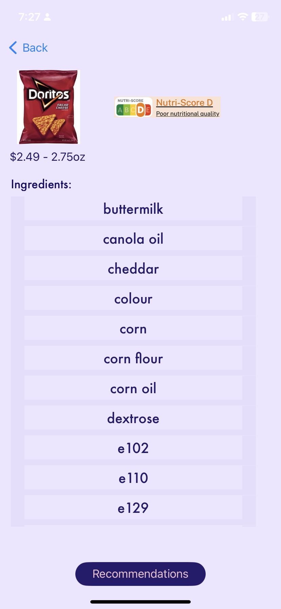

# Ingredient Insight
Health App that scans food products and gives a description of each ingredient

The social problem we are solving is that of people willingly or unknowingly consuming food, particularly some specific ingredients, which might be banned in other countries. 

As an example, Red 40 ingredient is a color dye commonly used in breakfast cereals, sodas, condiments, puddings, dairy products, and chips, to name a few. But there are reports (https://www.integrativenutrition.com/blog/2016/09/red-40-side-effects) stating that Red 40 has been linked to minor discomforts like jitteriness, nervousness to increased ADHD symptoms. 

But these kinds of unhealthy and harmful ingredients aren’t easily known due to the complex names used in the ingredient lists, or due to common people not having any knowledge of the said ingredients. Besides, the healthier alternatives are often not easily available, or are not sold at a similar price point. 

With this project, we want to raise awareness about beneficial or harmful effects of food products as a whole, and break it down to the granularity of ingredients. We also offer healthier and cost-effective alternatives for each food product, along with the information about the closest retail store where the alternative would be available. 

While eating unhealthy is in no one's wishlist, the people who cannot always afford organic alternatives or the people who simply do not know the harmful effects of the processed food are the most affected by this issue of unhealthy diet. Our product is aimed towards educating people to learn what they are consuming, make an educated choice between taste and health, and still be cost-effective whenever possible. 

The innovative solution we are proposing is an app, called ‘Ingredient Insight’, that would scan a food product’s barcode and list all the ingredients, price, volume, and “Nutri-score” (recommended by European Commission and WHO) of that food product. The user then would be able to click on each ingredient individually and read more in depth on that specific ingredient, including its health risk rating. The app will also have the option to recommend healthier alternatives, which would allow people to easily make better choices for their health.

